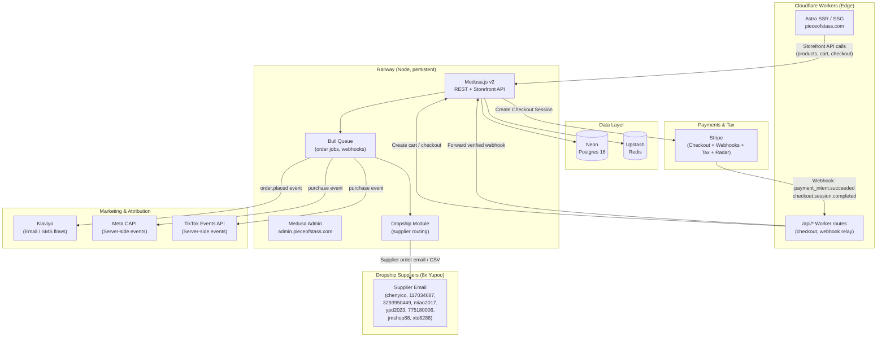
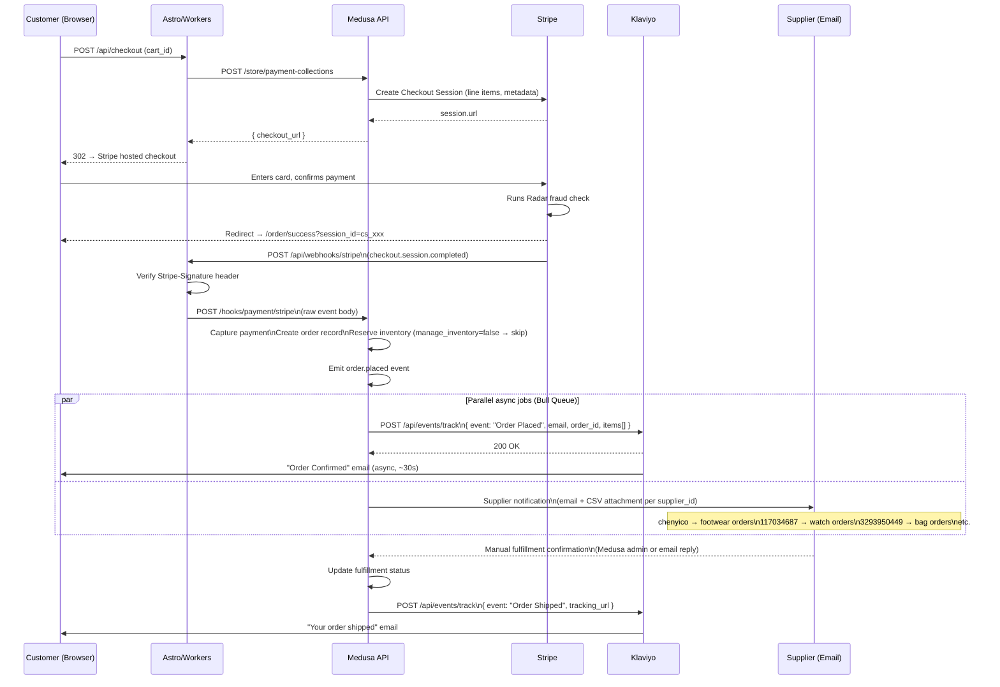

# Commerce Backend Architecture — Piece of Stass

> **Status:** Decision finalized — June 2026  
> **Owner:** Commerce Engineer  
> **Audience:** Frontend agent, DevOps agent, future maintainers

---

## 1. Recommended Stack

| Layer | Service | Rationale |
|---|---|---|
| Commerce API | **Medusa.js v2** | Open-source, self-hosted, TypeScript-native, modular. Full control over dropship logic, no per-transaction fees, built-in order/cart/product APIs. |
| Backend host | **Railway** (primary) or **Fly.io** (fallback) | Both run persistent Node processes. Railway has zero-config Postgres add-on and auto-deploys from GitHub. Fly gives more control for multi-region. **Cloudflare Workers cannot host Medusa** — Workers are stateless V8 isolates with no persistent file system or long-running process support. |
| Database | **Neon** (serverless Postgres) | Branching for staging, auto-suspend for cost, Postgres 16, pg_vector ready for future search. |
| Cache / Queue | **Upstash Redis** | Per-request billing, no idle cost, compatible with Medusa's Bull queue and session caching. |
| Storefront | **Astro on Cloudflare Workers** | SSR/SSG hybrid. Talks to Medusa via Storefront API. Stripe Checkout Session redirects are external so no persistent socket needed from Workers. |
| Payments | **Stripe** | Stripe Checkout Session flow (hosted page). Stripe Tax for automatic US/EU/UK/CA tax calculation — no TaxJar integration needed. Stripe Radar for fraud screening. |
| Email / CRM | **Klaviyo** | Triggered email flows for order placed, shipped, abandoned cart, review request. |
| Ad attribution | **Meta CAPI** + **TikTok Events API** | Server-side event matching for privacy-safe attribution. Fired from Medusa webhooks/subscribers, not from the browser. |
| Dropship routing | **Custom Medusa module** (`dropship`) | Maps each product's `supplier_id` to one of 8 Yupoo sources, formats and sends a supplier notification email/CSV on order placement. |

---

## 2. Fallback: Shopify Headless

If Stripe permanently risk-flags the merchant account (e.g., product category MISMATCH, excessive chargebacks early on), fall back to:

- **Shopify Headless** — $39/mo Basic plan + 2% transaction fee on all external gateways; use Shop Pay to reduce fee to 0%.
- Storefront API (GraphQL) stays the same — the frontend Astro layer calls Shopify instead of Medusa.
- Loss of custom dropship logic → replaced with **Shopify Flow** + email notification automation.
- Klaviyo, Meta CAPI, TikTok Events remain unchanged (fire from Shopify webhooks instead).

Trigger criteria for fallback:
1. Stripe sends a "restricted business" notice or holds >$500 for >7 days.
2. Chargeback rate exceeds 0.75% in the first 60 days.

---

## 3. System Architecture Diagram



---

## 4. Cost Model

### Medusa Self-Host on Railway

| Resource | Cost/mo |
|---|---|
| Railway Hobby plan (Node process, 512 MB RAM) | $5 base + usage ~$8–15 |
| Neon free tier → Pro at scale | $0–19 |
| Upstash Redis (< 10k commands/day free) | $0–3 |
| **Total at launch** | **~$13–37/mo** |
| **Total at ~500 orders/mo** | **~$25–45/mo** |

Zero per-transaction platform fee. Stripe charges 2.9% + $0.30 per transaction regardless of platform.

### Shopify Headless (Fallback)

| Resource | Cost/mo |
|---|---|
| Shopify Basic plan | $39 |
| Transaction fee (non-Shop-Pay gateway) | 2% × GMV |
| **At $5,000 GMV/mo** | **$139/mo** |
| **At $10,000 GMV/mo** | **$239/mo** |

### Breakeven Analysis

Let \( G \) = monthly GMV in USD.

Medusa monthly cost ≈ $35 (flat, infrastructure only).  
Shopify monthly cost ≈ $39 + 0.02G.

Breakeven: \( 35 = 39 + 0.02G \) → \( G = -200 \) — **Medusa is cheaper at every GMV level when using a non-Shop-Pay gateway.**

At \( G = \$5{,}000 \): Medusa saves ~$104/mo. At \( G = \$50{,}000 \): Medusa saves ~$1,004/mo.

**Recommendation:** Start with Medusa. The only valid reason to switch is Stripe merchant risk, not cost.

---

## 5. Order → Supplier Data Flow



---

## 6. Regions and Shipping Zones

| Region | Currency | Shipping zones | Tax |
|---|---|---|---|
| US (default) | USD | CONUS standard / expedited | Stripe Tax (US nexus auto-detect) |
| EU | EUR | EU standard (7–14 days) | Stripe Tax (VAT OSS) |
| UK | GBP | UK standard | Stripe Tax (UK VAT 20%) |
| CA | CAD | Canada standard | Stripe Tax (GST/HST) |

---

## 7. Security Posture

- Stripe webhook signature verified with `stripe.webhooks.constructEvent()` before any Medusa call.
- Medusa Admin (`/admin`) restricted to Railway private network — not publicly routable. Access via Railway tunnel or VPN.
- Neon connection string uses SSL-required (`?sslmode=require`).
- All supplier URLs (Yupoo links, `supplier_id`, `supplier_url`) stored only in Medusa's internal product metadata — never returned by Storefront API.
- No brand/trademark data exposed in any customer-facing API response, SEO field, or webhook payload.
- Meta CAPI and TikTok Events fired server-side only; no pixel data in browser HTML.

---

## 8. Deployment Topology

```
GitHub repo (pieceofstass.com)
├── apps/
│   ├── storefront/          → Cloudflare Workers (wrangler deploy)
│   └── medusa/              → Railway (Dockerfile or Nixpacks)
├── packages/
│   └── types/               → Shared TypeScript types
└── infra/
    └── railway.toml
        fly.toml             (fallback)
```

Railway auto-deploy: push to `main` → Railway detects `apps/medusa/` → runs `npm run build && npm start`.

---

## 9. References

- [Medusa.js v2 Documentation](https://docs.medusajs.com)
- [Medusa v2 Deployment on Railway](https://docs.medusajs.com/deployments/server/railway)
- [Stripe Tax Documentation](https://stripe.com/docs/tax)
- [Neon Serverless Postgres](https://neon.tech/docs)
- [Upstash Redis](https://upstash.com/docs/redis/overall/getstarted)
- [Klaviyo Server-Side Events API](https://developers.klaviyo.com/en/reference/create_event)
- [Meta Conversions API](https://developers.facebook.com/docs/marketing-api/conversions-api)
- [TikTok Events API](https://ads.tiktok.com/marketing_api/docs?id=1741601162187777)
